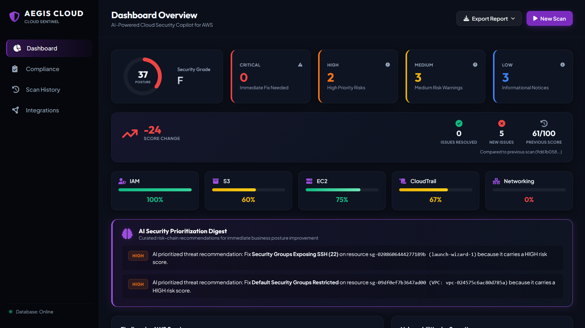
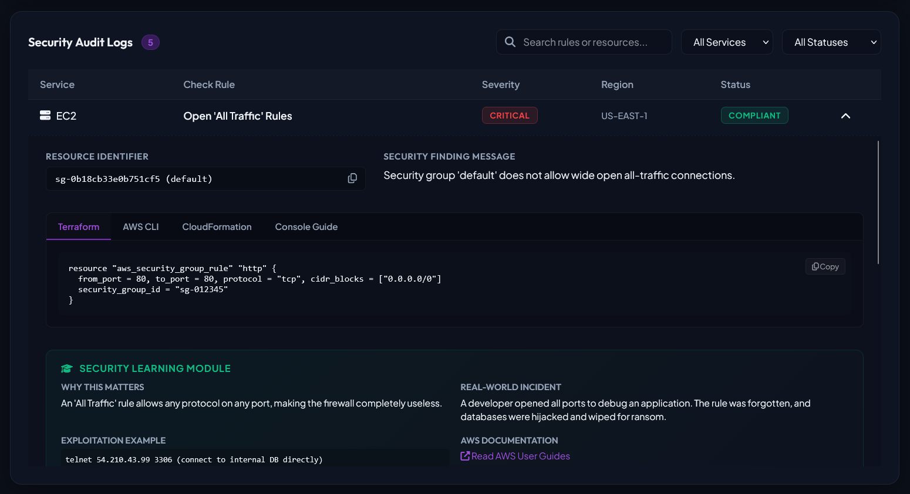
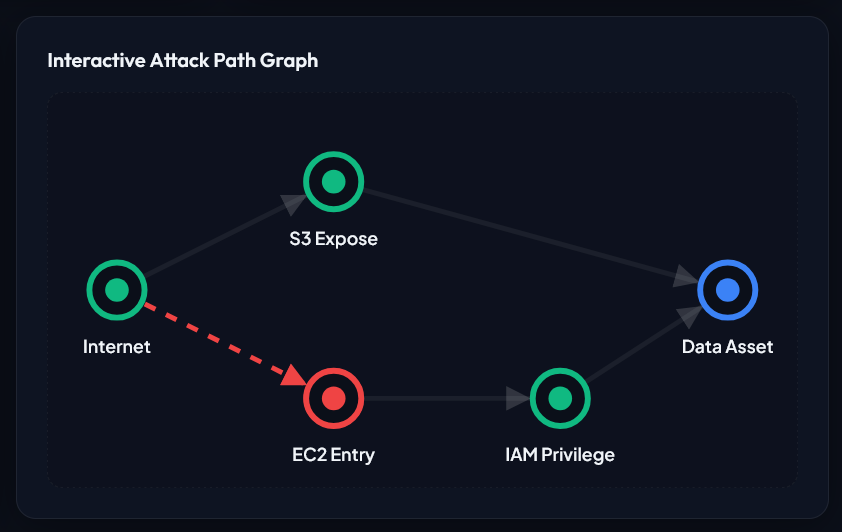
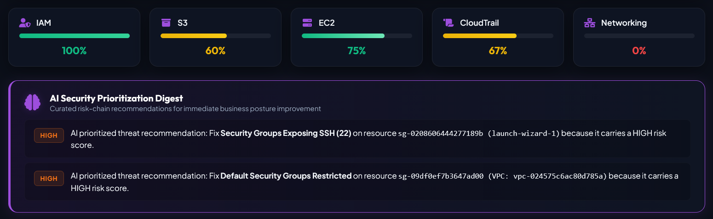
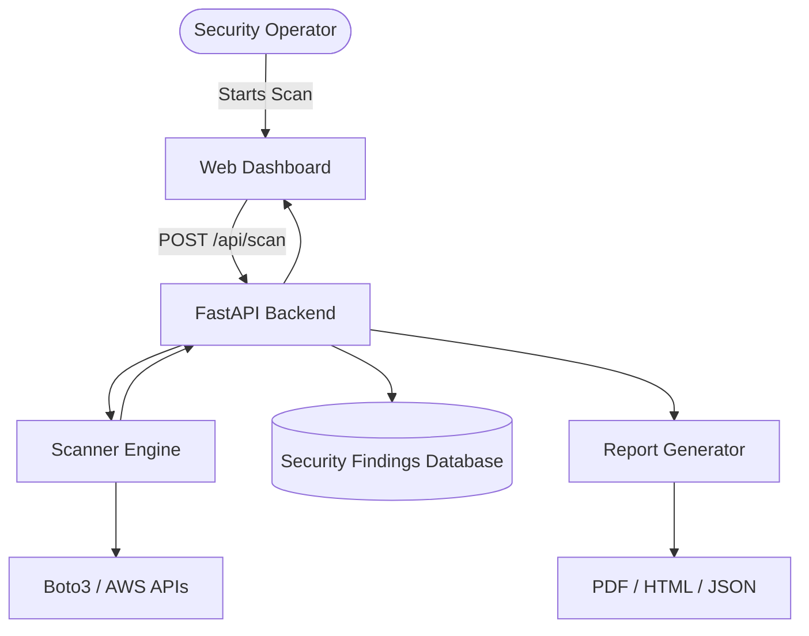

# 🛡️ Aegis Cloud Sentinel

> **AI-Powered Cloud Security Posture Management (CSPM) Platform for AWS**

Aegis Cloud Sentinel is a modular Cloud Security Posture Management (CSPM) platform that helps security teams identify, prioritize, and remediate security misconfigurations across AWS environments. It performs automated security assessments, calculates an overall security posture score, generates professional audit reports, and presents findings through a modern, responsive dashboard.

Built with **Python**, **FastAPI**, **Boto3**, **SQLite**, **Docker**, and modern web technologies.

---

## 📸 Dashboard Preview

### Dashboard


### Security Findings


### Attack Path Graph


### AI Gemini Q&A Assistant


# ✨ Features

* 🔍 Automated AWS security posture assessments
* ☁️ Multi-service AWS security auditing
* 📊 Weighted security posture scoring (0–100)
* 🤖 AI-powered security explanations and remediation guidance
* 📄 Exportable PDF, HTML, and JSON audit reports
* 📈 Historical scan tracking
* ⚡ Interactive dark-themed dashboard
* 🐳 Docker support
* 🧩 Modular scanner architecture for easy extensibility

---

# 🏗️ Architecture



---

# 🔒 Security Checks

## Identity & Access Management (IAM)

* Root account MFA verification
* IAM users without MFA
* Access key age audit
* AdministratorAccess detection
* Wildcard policy analysis (`*:*`)
* Inactive IAM users
* Unused IAM roles

---

## Amazon S3

* Public bucket detection
* Default encryption validation
* Bucket versioning audit
* Server access logging
* Block Public Access verification

---

## Amazon EC2

* Public IP detection
* SSH exposure (Port 22)
* RDP exposure (Port 3389)
* All-traffic security group rules
* EBS volume encryption

---

## AWS CloudTrail

* Trail enabled
* Multi-region trail validation
* Log integrity validation

---

## VPC & Networking

* Default VPC usage
* Default Security Group audit
* Internet-facing non-standard ports

---

# 📊 Security Score

Aegis calculates an overall security posture score between **0** and **100**.

```
Score = 100 − Σ(Failed Check Weight)
```

### Severity Weights

| Severity    | Deduction |
| ----------- | --------: |
| 🔴 Critical |       -20 |
| 🟠 High     |       -15 |
| 🟡 Medium   |        -8 |
| 🔵 Low      |        -3 |

### Score Interpretation

| Score  | Status            |
| ------ | ----------------- |
| 90–100 | Excellent         |
| 75–89  | Good              |
| 60–74  | Needs Improvement |
| 40–59  | High Risk         |
| 0–39   | Critical          |

---

# 🤖 AI Gemini Q&A Assistant

The integrated AI Gemini Q&A Assistant helps analysts understand and remediate security findings by:

* Explaining detected vulnerabilities
* Prioritizing security risks
* Recommending AWS best-practice fixes
* Generating executive summaries
* Providing contextual remediation guidance

---

# 📑 Reports

Generate professional security reports in multiple formats:

* PDF
* HTML
* JSON

Each report includes:

* Executive Summary
* Security Score
* Findings by Severity
* Resource Details
* Recommended Remediation Steps

---

# 🛠️ Tech Stack

## Backend

* Python
* FastAPI
* Boto3
* SQLite

## Frontend

* HTML5
* CSS3
* JavaScript

## AWS Services

* IAM
* EC2
* S3
* CloudTrail
* VPC

## DevOps

* Docker
* Git

---

# 📁 Project Structure

```text
.
├── app.py
├── scanners/
├── reports/
├── services/
├── database/
├── templates/
├── static/
├── output/
├── requirements.txt
├── Dockerfile
└── README.md
```

---

# 🚀 Quick Start

## Local Installation

### 1. Clone the repository

```bash
git clone https://github.com/perkyPearl/aegis-cloud-sentinel.git
cd aegis-cloud-sentinel
```

### 2. Create a virtual environment

```bash
python -m venv venv
```

Windows

```bash
venv\Scripts\activate
```

Linux/macOS

```bash
source venv/bin/activate
```

### 3. Install dependencies

```bash
pip install -r requirements.txt
```

### 4. Configure AWS credentials

```bash
aws configure
```

or use environment variables/IAM roles.

### 5. Start the application

```bash
python app.py
```

Visit:

```
http://localhost:8000
```

---

# 🐳 Docker Deployment

Build the image

```bash
docker build -t aegis-cloud-sentinel .
```

Run the container

```bash
docker run -d -p 8000:8000 --name aegis aegis-cloud-sentinel
```

Open:

```
http://localhost:8000
```

---

# 🤝 Contributing

Contributions are welcome!

If you'd like to improve Aegis Cloud Sentinel:

1. Fork the repository
2. Create a feature branch
3. Commit your changes
4. Open a Pull Request

---

# 📄 License

This project is licensed under the MIT License.

---

# 👨‍💻 Author

**Pearl**

Cybersecurity Engineer | Cloud Security | Identity Security | Security Automation

If you found this project useful, consider giving it a ⭐ to support the project.
